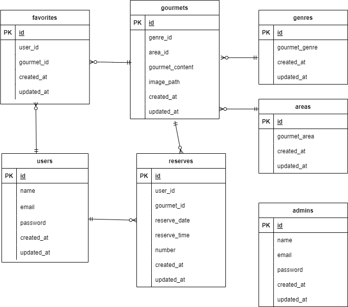

***Rese***

**実装済み機能**
・認証
・ユーザ情報取得
・飲食店お気に入り
・予約、予約削除機能
・飲食店一覧
・飲食店詳細取得
・検索機能

**環境構築方法**

1. git clone git@github.com:JonyTask/Rese_Jony.git
2. docker-compose up -d --build
3. .envファイルの編集
4. docker-compose exec php bash
5. composer update
6. php artisan key:generate
7. php artisan migrate:fresh
8. php artisan db:seed

**ER図**

